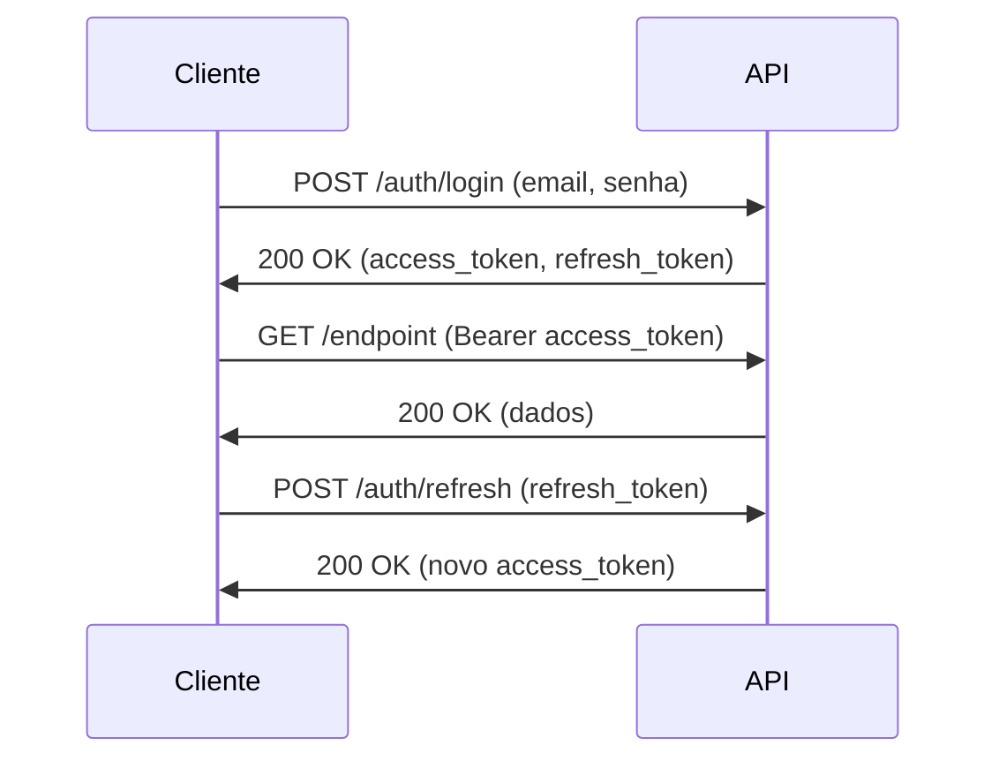

# 📚 API Documentation - Sistema de Gestão de Chamados

**Versão:** 2.0.0  
**Base URL:** `https://api.suporte.empresa.com/api/v1`  
**Documentação Interativa:** `/docs` (Swagger) | `/redoc` (ReDoc)

## 📋 Índice

- [Visão Geral](#visão-geral)
- [Autenticação](#autenticação)
- [Rate Limiting](#rate-limiting)
- [Códigos de Status](#códigos-de-status)
- [Endpoints](#endpoints)
  - [1. Autenticação](#1-autenticação-authpost)
  - [2. Usuários](#2-usuários-users)
  - [3. Equipes](#3-equipes-teams)
  - [4. Clientes](#4-clientes-customers)
  - [5. Chamados](#5-chamados-tickets)
  - [6. Comentários e Anexos](#6-comentários-e-anexos-commentsattachments)
  - [7. Tempo e Tracking](#7-tempo-e-tracking-timetracking)
  - [8. Dashboards](#8-dashboards)
  - [9. Relatórios](#9-relatórios-reports)
  - [10. Configurações](#10-configurações-settings)
  - [11. Notificações](#11-notificações-notifications)
  - [12. Busca e Filtros](#12-busca-e-filtros-searchfilters)
  - [13. Métricas](#13-métricas-metrics)
- [Modelos de Dados](#modelos-de-dados)
- [Webhooks](#webhooks)
- [WebSockets](#websockets)
- [Códigos de Erro](#códigos-de-erro)
- [Exemplos de Integração](#exemplos-de-integração)

---

## 🎯 Visão Geral

API RESTful para sistema completo de gestão de chamados de suporte técnico, desenvolvida com **FastAPI** e otimizada para alta performance e escalabilidade.

## 🚀 Quick Start

### 1. Iniciar o servidor
```bash
make dev
# API disponível em http://localhost:8001
# Documentação em http://localhost:8001/docs
```

### 2. Fazer login (exemplo com Diretor)
```bash
curl -X POST http://localhost:8001/api/v1/auth/login \
  -H "Content-Type: application/json" \
  -d '{
    "email": "lee@empresa.com",
    "password": "admin123"
  }'
```

### 3. Usar o token retornado
```bash
TOKEN="seu_token_aqui"
curl -X GET http://localhost:8001/api/v1/auth/me \
  -H "Authorization: Bearer $TOKEN"
```

### 4. Acessar Swagger UI
Navegue para http://localhost:8001/docs para testar interativamente todos os endpoints.

### 🔑 Características Principais

- **Autenticação JWT** com refresh tokens
- **RBAC** com 7 níveis hierárquicos
- **Multi-tenant** com isolamento completo
- **SLA automático** com escalação
- **Rate limiting** por endpoint
- **Versionamento** de API
- **HATEOAS** compliance
- **OpenAPI 3.0** specification

### 🏗️ Arquitetura

```
┌─────────────────────────────────────────────────────┐
│                   Load Balancer                      │
├─────────────────────────────────────────────────────┤
│                  Nginx (SSL/TLS)                     │
├─────────────────────────────────────────────────────┤
│              FastAPI Application (8001)              │
├──────────────────────┬──────────────────────────────┤
│     PostgreSQL       │        Redis                 │
│    (Primary DB)      │   (Cache/Sessions)           │
└──────────────────────┴──────────────────────────────┘
```

---

## 🔐 Autenticação

### JWT Bearer Token

Todas as requisições (exceto login) requerem autenticação via JWT Bearer Token.

```http
Authorization: Bearer <token>
```

### Fluxo de Autenticação



### Tipos de Usuário (RBAC)

| Tipo | Nível | Descrição |
|------|-------|-----------|
| `DIRECTOR` | 1 | Acesso total ao sistema |
| `SUPPORT_COORDINATOR` | 2 | Gestão de equipes e suporte |
| `SENIOR_DEVELOPER` | 3 | Desenvolvimento e liderança técnica |
| `SUPPORT_ANALYST` | 4 | Atendimento e suporte |
| `ADMINISTRATIVE` | 5 | Gestão administrativa |
| `COMMERCIAL` | 6 | Gestão comercial e clientes |
| `DESIGNER` | 7 | Design e UX |

### 🧪 Usuários de Teste Disponíveis

O sistema conta com usuários pré-cadastrados para teste e desenvolvimento:

| Nome | Email | Senha | Tipo | Permissões |
|------|-------|-------|------|------------|
| **Lee Chardes** | `lee@empresa.com` | `admin123` | DIRECTOR | Acesso total (70+ permissões) |
| **Diego Santos** | `diego@empresa.com` | `admin123` | DIRECTOR | Acesso total |
| **Rodrigo Silva** | `rodrigo@empresa.com` | `admin123` | DIRECTOR | Acesso total |
| **Gláucia Coordenadora** | `glaucia@empresa.com` | `coord123` | SUPPORT_COORDINATOR | Gestão de equipes e chamados |
| **Moral Developer** | `moral@empresa.com` | `dev123` | SENIOR_DEVELOPER | Desenvolvimento e deploy |
| **Mariana Analista** | `mariana@empresa.com` | `suporte123` | SUPPORT_ANALYST | Atendimento e suporte |
| **Giseline Analista** | `giseline@empresa.com` | `suporte123` | SUPPORT_ANALYST | Atendimento e suporte |
| **Andréa Administrativa** | `andrea@empresa.com` | `admin123` | ADMINISTRATIVE | Gestão administrativa |
| **Débora Designer** | `debora@empresa.com` | `design123` | DESIGNER | Design e UX |

**⚠️ Nota:** Estes usuários são apenas para ambiente de desenvolvimento e teste. Em produção, devem ser removidos ou ter suas senhas alteradas.

---

## ⚡ Rate Limiting

| Endpoint Type | Limite | Janela |
|--------------|--------|---------|
| Autenticação | 5 req | 1 minuto |
| Leitura (GET) | 100 req | 1 minuto |
| Escrita (POST/PUT) | 30 req | 1 minuto |
| Delete | 10 req | 1 minuto |
| Busca Global | 20 req | 1 minuto |
| Export/Reports | 5 req | 5 minutos |

---

## 📊 Códigos de Status

| Código | Descrição |
|--------|-----------|
| `200 OK` | Requisição bem-sucedida |
| `201 Created` | Recurso criado com sucesso |
| `204 No Content` | Operação bem-sucedida sem retorno |
| `400 Bad Request` | Erro na requisição |
| `401 Unauthorized` | Não autenticado |
| `403 Forbidden` | Sem permissão |
| `404 Not Found` | Recurso não encontrado |
| `409 Conflict` | Conflito de dados |
| `422 Unprocessable Entity` | Erro de validação |
| `429 Too Many Requests` | Rate limit excedido |
| `500 Internal Server Error` | Erro do servidor |

---

## 🚀 Endpoints

### 1. Autenticação (`/auth`)

#### 🔐 POST `/auth/login`
Autenticação de usuário

**Request:**
```json
{
  "email": "lee@empresa.com",
  "password": "admin123",
  "remember_me": false
}
```

**Nota:** O campo deve ser `password` e não `senha`.

**Response:** `200 OK`
```json
{
  "access_token": "eyJhbGciOiJIUzI1NiIs...",
  "refresh_token": "eyJhbGciOiJIUzI1NiIs...",
  "token_type": "Bearer",
  "expires_in": 3600,
  "user": {
    "id": "550e8400-e29b-41d4-a716-446655440000",
    "nome": "João Silva",
    "email": "usuario@empresa.com",
    "tipo_usuario": "SUPPORT_ANALYST",
    "ativo": true
  }
}
```

#### 🔄 POST `/auth/refresh`
Renovar access token

**Request:**
```json
{
  "refresh_token": "eyJhbGciOiJIUzI1NiIs..."
}
```

**Response:** `200 OK`
```json
{
  "access_token": "eyJhbGciOiJIUzI1NiIs...",
  "token_type": "Bearer",
  "expires_in": 3600
}
```

#### 🚪 POST `/auth/logout`
Logout e invalidação de tokens

**Headers:**
```http
Authorization: Bearer <token>
```

**Response:** `204 No Content`

#### 👤 GET `/auth/me`
Dados do usuário autenticado

**Response:** `200 OK`
```json
{
  "id": "550e8400-e29b-41d4-a716-446655440000",
  "nome": "João Silva",
  "email": "usuario@empresa.com",
  "tipo_usuario": "SUPPORT_ANALYST",
  "equipe": {
    "id": "123e4567-e89b-12d3-a456-426614174000",
    "nome": "Suporte Nível 1"
  },
  "permissoes": [
    "CHAMADOS_VIEW_OWN",
    "CHAMADOS_CREATE",
    "CHAMADOS_EDIT"
  ],
  "ultimo_acesso": "2025-01-02T14:30:00Z",
  "created_at": "2024-01-15T10:00:00Z"
}
```

#### 🔑 POST `/auth/change-password`
Alterar senha

**Request:**
```json
{
  "senha_atual": "senhaAtual123!",
  "senha_nova": "novaSenha456!",
  "confirmar_senha": "novaSenha456!"
}
```

**Response:** `200 OK`
```json
{
  "message": "Senha alterada com sucesso",
  "require_login": true
}
```

#### ✅ POST `/auth/validate-token`
Validar token

**Request:**
```json
{
  "token": "eyJhbGciOiJIUzI1NiIs..."
}
```

**Response:** `200 OK`
```json
{
  "valid": true,
  "expires_at": "2025-01-02T15:30:00Z",
  "user_id": "550e8400-e29b-41d4-a716-446655440000"
}
```

#### 💪 POST `/auth/check-password-strength`
Verificar força da senha

**Request:**
```json
{
  "password": "senhaParaVerificar123!"
}
```

**Response:** `200 OK`
```json
{
  "score": 85,
  "strength": "strong",
  "suggestions": [
    "Considere adicionar caracteres especiais"
  ]
}
```

---

### 2. Usuários (`/users`)

#### 📋 GET `/users`
Listar usuários

**Query Parameters:**
- `page` (int): Página atual (default: 1)
- `limit` (int): Items por página (default: 20, max: 100)
- `tipo_usuario` (string): Filtrar por tipo
- `ativo` (bool): Filtrar por status
- `equipe_id` (uuid): Filtrar por equipe
- `search` (string): Busca por nome/email

**Response:** `200 OK`
```json
{
  "items": [
    {
      "id": "550e8400-e29b-41d4-a716-446655440000",
      "nome": "João Silva",
      "email": "joao@empresa.com",
      "tipo_usuario": "SUPPORT_ANALYST",
      "equipe": {
        "id": "123e4567-e89b-12d3-a456-426614174000",
        "nome": "Suporte N1"
      },
      "ativo": true,
      "ultimo_acesso": "2025-01-02T14:30:00Z"
    }
  ],
  "total": 150,
  "page": 1,
  "pages": 8,
  "limit": 20
}
```

#### ➕ POST `/users`
Criar usuário

**Request:**
```json
{
  "nome": "Maria Santos",
  "email": "maria@empresa.com",
  "senha": "senhaSegura123!",
  "tipo_usuario": "SUPPORT_ANALYST",
  "equipe_id": "123e4567-e89b-12d3-a456-426614174000",
  "telefone": "(11) 98765-4321",
  "cargo": "Analista de Suporte",
  "departamento": "TI",
  "notificacoes_email": true,
  "notificacoes_sistema": true
}
```

**Response:** `201 Created`
```json
{
  "id": "660e8400-e29b-41d4-a716-446655440001",
  "nome": "Maria Santos",
  "email": "maria@empresa.com",
  "tipo_usuario": "SUPPORT_ANALYST",
  "created_at": "2025-01-02T15:00:00Z"
}
```

#### 👤 GET `/users/{user_id}`
Obter usuário específico

**Response:** `200 OK`
```json
{
  "id": "550e8400-e29b-41d4-a716-446655440000",
  "nome": "João Silva",
  "email": "joao@empresa.com",
  "tipo_usuario": "SUPPORT_ANALYST",
  "telefone": "(11) 91234-5678",
  "cargo": "Analista de Suporte Senior",
  "departamento": "TI",
  "equipe": {
    "id": "123e4567-e89b-12d3-a456-426614174000",
    "nome": "Suporte N1",
    "membros_count": 8
  },
  "perfil": {
    "avatar_url": "https://storage.empresa.com/avatars/joao.jpg",
    "bio": "Especialista em suporte técnico",
    "especialidades": ["Python", "Docker", "Linux"],
    "certificacoes": ["ITIL", "AWS"]
  },
  "metricas": {
    "chamados_resolvidos": 342,
    "tempo_medio_resposta": "2h 15min",
    "satisfacao_cliente": 4.8
  },
  "ativo": true,
  "created_at": "2024-01-15T10:00:00Z",
  "updated_at": "2025-01-02T14:30:00Z"
}
```

#### ✏️ PUT `/users/{user_id}`
Atualizar usuário

**Request:**
```json
{
  "nome": "João Silva Santos",
  "telefone": "(11) 91234-5678",
  "cargo": "Analista de Suporte Senior",
  "notificacoes_email": false
}
```

**Response:** `200 OK`

#### 🗑️ DELETE `/users/{user_id}`
Desativar usuário

**Response:** `204 No Content`

#### 🔄 POST `/users/{user_id}/reset-password`
Resetar senha do usuário

**Response:** `200 OK`
```json
{
  "message": "Email com instruções enviado para o usuário",
  "reset_token_sent": true
}
```

#### 📊 GET `/users/{user_id}/permissions`
Listar permissões do usuário

**Response:** `200 OK`
```json
{
  "user_id": "550e8400-e29b-41d4-a716-446655440000",
  "tipo_usuario": "SUPPORT_ANALYST",
  "permissoes": [
    {
      "codigo": "CHAMADOS_VIEW_OWN",
      "nome": "Visualizar próprios chamados",
      "modulo": "chamados"
    },
    {
      "codigo": "CHAMADOS_CREATE",
      "nome": "Criar chamados",
      "modulo": "chamados"
    }
  ],
  "delegacoes_ativas": [
    {
      "de_usuario": "660e8400-e29b-41d4-a716-446655440001",
      "permissoes": ["CHAMADOS_ASSIGN"],
      "valido_ate": "2025-01-10T23:59:59Z"
    }
  ]
}
```

#### 🎯 PUT `/users/{user_id}/permissions`
Atualizar permissões

**Request:**
```json
{
  "adicionar": ["RELATORIOS_VIEW", "DASHBOARD_SUPPORT"],
  "remover": ["CHAMADOS_DELETE"]
}
```

**Response:** `200 OK`

---

### 3. Equipes (`/teams`)

#### 📋 GET `/teams`
Listar equipes

**Response:** `200 OK`
```json
{
  "items": [
    {
      "id": "123e4567-e89b-12d3-a456-426614174000",
      "nome": "Suporte Nível 1",
      "descricao": "Equipe de primeiro atendimento",
      "lider": {
        "id": "550e8400-e29b-41d4-a716-446655440000",
        "nome": "João Silva"
      },
      "membros_count": 8,
      "ativa": true,
      "metricas": {
        "chamados_mes": 450,
        "tempo_medio_resposta": "1h 30min",
        "satisfacao": 4.7
      }
    }
  ],
  "total": 5
}
```

#### ➕ POST `/teams`
Criar equipe

**Request:**
```json
{
  "nome": "Desenvolvimento Backend",
  "descricao": "Equipe de desenvolvimento de APIs",
  "lider_id": "550e8400-e29b-41d4-a716-446655440000",
  "tipo": "DESENVOLVIMENTO",
  "especialidades": ["Python", "FastAPI", "PostgreSQL"]
}
```

**Response:** `201 Created`

#### 👥 GET `/teams/{team_id}/members`
Listar membros da equipe

**Response:** `200 OK`
```json
{
  "equipe": {
    "id": "123e4567-e89b-12d3-a456-426614174000",
    "nome": "Suporte Nível 1"
  },
  "membros": [
    {
      "id": "550e8400-e29b-41d4-a716-446655440000",
      "nome": "João Silva",
      "cargo": "Analista de Suporte",
      "papel_equipe": "LIDER",
      "desde": "2024-01-15T10:00:00Z"
    }
  ],
  "total": 8
}
```

#### ➕ POST `/teams/{team_id}/members`
Adicionar membro à equipe

**Request:**
```json
{
  "usuario_id": "660e8400-e29b-41d4-a716-446655440001",
  "papel": "MEMBRO"
}
```

**Response:** `201 Created`

#### ➖ DELETE `/teams/{team_id}/members/{user_id}`
Remover membro da equipe

**Response:** `204 No Content`

#### 📊 GET `/teams/{team_id}/metrics`
Métricas da equipe

**Query Parameters:**
- `periodo` (string): 7d, 30d, 90d, 1y
- `tipo_metrica` (string): performance, qualidade, produtividade

**Response:** `200 OK`
```json
{
  "periodo": "30d",
  "metricas": {
    "chamados": {
      "total": 450,
      "resolvidos": 420,
      "em_andamento": 30,
      "taxa_resolucao": 93.3
    },
    "tempo": {
      "medio_resposta": "1h 30min",
      "medio_resolucao": "4h 15min",
      "dentro_sla": 92.5
    },
    "qualidade": {
      "satisfacao_cliente": 4.7,
      "reaberturas": 12,
      "taxa_retrabalho": 2.8
    },
    "produtividade": {
      "chamados_por_membro": 56.25,
      "horas_trabalhadas": 1280,
      "eficiencia": 87.5
    }
  }
}
```

---

### 4. Clientes (`/customers`)

#### 📋 GET `/customers`
Listar clientes

**Query Parameters:**
- `segmento` (string): Filtrar por segmento
- `ativo` (bool): Filtrar por status
- `cidade` (string): Filtrar por cidade
- `estado` (string): Filtrar por estado

**Response:** `200 OK`
```json
{
  "items": [
    {
      "id": "770e8400-e29b-41d4-a716-446655440002",
      "nome": "Tech Solutions Ltda",
      "cnpj": "12.345.678/0001-00",
      "segmento": "Tecnologia",
      "plano": "ENTERPRISE",
      "filiais_count": 3,
      "sistemas_count": 5,
      "contato_principal": {
        "nome": "Carlos Mendes",
        "email": "carlos@techsolutions.com",
        "telefone": "(11) 3456-7890"
      },
      "ativo": true,
      "cliente_desde": "2023-05-10T00:00:00Z"
    }
  ],
  "total": 45
}
```

#### ➕ POST `/customers`
Criar cliente

**Request:**
```json
{
  "nome": "Nova Empresa SA",
  "cnpj": "98.765.432/0001-00",
  "razao_social": "Nova Empresa Soluções e Serviços SA",
  "segmento": "Varejo",
  "plano": "PROFESSIONAL",
  "contato_principal": {
    "nome": "Ana Costa",
    "email": "ana@novaempresa.com",
    "telefone": "(21) 98765-4321",
    "cargo": "Gerente de TI"
  },
  "endereco": {
    "rua": "Rua das Flores",
    "numero": "123",
    "complemento": "Sala 401",
    "bairro": "Centro",
    "cidade": "São Paulo",
    "estado": "SP",
    "cep": "01234-567"
  },
  "configuracoes": {
    "sla_padrao": "STANDARD",
    "notificacoes": true,
    "relatorios_automaticos": true
  }
}
```

**Response:** `201 Created`

#### 🏢 GET `/customers/{customer_id}`
Obter cliente específico

**Response:** `200 OK`
```json
{
  "id": "770e8400-e29b-41d4-a716-446655440002",
  "nome": "Tech Solutions Ltda",
  "cnpj": "12.345.678/0001-00",
  "razao_social": "Tech Solutions Tecnologia Ltda",
  "segmento": "Tecnologia",
  "plano": "ENTERPRISE",
  "contato_principal": {
    "nome": "Carlos Mendes",
    "email": "carlos@techsolutions.com",
    "telefone": "(11) 3456-7890",
    "cargo": "Diretor de TI"
  },
  "endereco": {
    "rua": "Av. Paulista",
    "numero": "1000",
    "complemento": "10º andar",
    "bairro": "Bela Vista",
    "cidade": "São Paulo",
    "estado": "SP",
    "cep": "01310-100"
  },
  "filiais": [
    {
      "id": "880e8400-e29b-41d4-a716-446655440003",
      "nome": "Filial Rio de Janeiro",
      "cidade": "Rio de Janeiro",
      "estado": "RJ"
    }
  ],
  "sistemas": [
    {
      "id": "990e8400-e29b-41d4-a716-446655440004",
      "nome": "ERP Integrado",
      "versao": "2.5.0"
    }
  ],
  "metricas": {
    "chamados_total": 1250,
    "chamados_mes_atual": 45,
    "satisfacao_media": 4.6,
    "tempo_cliente": "1 ano 8 meses"
  },
  "configuracoes": {
    "sla_padrao": "PREMIUM",
    "tempo_resposta": "2h",
    "tempo_resolucao": "8h",
    "notificacoes": true
  },
  "ativo": true,
  "created_at": "2023-05-10T10:00:00Z"
}
```

#### ✏️ PUT `/customers/{customer_id}`
Atualizar cliente

**Response:** `200 OK`

#### 🗑️ DELETE `/customers/{customer_id}`
Desativar cliente

**Response:** `204 No Content`

#### 🏢 GET `/customers/{customer_id}/branches`
Listar filiais do cliente

**Response:** `200 OK`
```json
{
  "cliente": {
    "id": "770e8400-e29b-41d4-a716-446655440002",
    "nome": "Tech Solutions Ltda"
  },
  "filiais": [
    {
      "id": "880e8400-e29b-41d4-a716-446655440003",
      "nome": "Filial Rio de Janeiro",
      "codigo": "RJ001",
      "endereco": {
        "cidade": "Rio de Janeiro",
        "estado": "RJ",
        "endereco_completo": "Av. Rio Branco, 100"
      },
      "responsavel": {
        "nome": "Pedro Santos",
        "email": "pedro@techsolutions.com",
        "telefone": "(21) 3456-7890"
      },
      "sistemas_ativos": 3,
      "usuarios_count": 15,
      "ativa": true
    }
  ],
  "total": 3
}
```

#### 💻 GET `/customers/{customer_id}/systems`
Listar sistemas do cliente

**Response:** `200 OK`
```json
{
  "sistemas": [
    {
      "id": "990e8400-e29b-41d4-a716-446655440004",
      "nome": "ERP Integrado",
      "versao": "2.5.0",
      "tecnologia": "Python/FastAPI",
      "ambiente": "PRODUCTION",
      "url": "https://erp.techsolutions.com",
      "usuarios_ativos": 45,
      "ultimo_deploy": "2025-01-01T03:00:00Z",
      "health_status": "HEALTHY"
    }
  ]
}
```

#### 📊 GET `/customers/{customer_id}/metrics`
Métricas do cliente

**Response:** `200 OK`
```json
{
  "periodo": "30d",
  "metricas": {
    "chamados": {
      "total": 45,
      "abertos": 5,
      "em_andamento": 8,
      "resolvidos": 32,
      "por_prioridade": {
        "critica": 2,
        "alta": 10,
        "media": 20,
        "baixa": 13
      }
    },
    "sla": {
      "cumprimento": 94.5,
      "violacoes": 2,
      "em_risco": 1
    },
    "satisfacao": {
      "media": 4.6,
      "nps": 72,
      "avaliacoes": 28
    },
    "financeiro": {
      "valor_contrato": 15000.00,
      "tickets_extras": 2500.00,
      "pendencias": 0
    }
  }
}
```

---

### 5. Chamados (`/tickets`)

#### 📋 GET `/tickets`
Listar chamados

**Query Parameters:**
- `status` (string): ABERTO, EM_ANDAMENTO, RESOLVIDO, FECHADO
- `prioridade` (string): CRITICA, ALTA, MEDIA, BAIXA
- `cliente_id` (uuid): Filtrar por cliente
- `desenvolvedor_id` (uuid): Filtrar por desenvolvedor
- `sla_status` (string): OK, EM_RISCO, VIOLADO
- `data_inicio` (date): Data inicial
- `data_fim` (date): Data final
- `orderby` (string): created_at, updated_at, prioridade, sla_vencimento

**Response:** `200 OK`
```json
{
  "items": [
    {
      "id": "aa0e8400-e29b-41d4-a716-446655440005",
      "numero": "TKT-2025-0042",
      "titulo": "Erro ao gerar relatório de vendas",
      "descricao": "Sistema apresenta erro 500 ao tentar gerar relatório",
      "tipo": "BUG_FIX",
      "categoria": "BACKEND",
      "prioridade": "ALTA",
      "status": "EM_ANDAMENTO",
      "cliente": {
        "id": "770e8400-e29b-41d4-a716-446655440002",
        "nome": "Tech Solutions Ltda"
      },
      "sistema": {
        "id": "990e8400-e29b-41d4-a716-446655440004",
        "nome": "ERP Integrado"
      },
      "desenvolvedor": {
        "id": "550e8400-e29b-41d4-a716-446655440000",
        "nome": "João Silva"
      },
      "sla": {
        "tipo": "PREMIUM",
        "tempo_resposta": "2h",
        "tempo_resolucao": "8h",
        "respondido_em": "1h 15min",
        "vencimento": "2025-01-02T22:00:00Z",
        "status": "OK"
      },
      "created_at": "2025-01-02T14:00:00Z",
      "updated_at": "2025-01-02T15:15:00Z"
    }
  ],
  "total": 234,
  "estatisticas": {
    "por_status": {
      "ABERTO": 45,
      "EM_ANDAMENTO": 67,
      "RESOLVIDO": 98,
      "FECHADO": 24
    },
    "por_prioridade": {
      "CRITICA": 5,
      "ALTA": 48,
      "MEDIA": 120,
      "BAIXA": 61
    },
    "sla_em_risco": 8,
    "sla_violados": 2
  }
}
```

#### ➕ POST `/tickets`
Criar chamado

**Request:**
```json
{
  "titulo": "Sistema não permite login",
  "descricao": "Usuários não conseguem fazer login no sistema desde as 14h",
  "tipo_chamado": "BUG_FIX",
  "categoria": "AUTHENTICATION",
  "prioridade": "CRITICA",
  "cliente_id": "770e8400-e29b-41d4-a716-446655440002",
  "filial_id": "880e8400-e29b-41d4-a716-446655440003",
  "sistema_id": "990e8400-e29b-41d4-a716-446655440004",
  "modulo": "Autenticação",
  "contato": {
    "nome": "Maria Santos",
    "email": "maria@techsolutions.com",
    "telefone": "(11) 98765-4321"
  },
  "informacoes_adicionais": {
    "navegador": "Chrome 120",
    "sistema_operacional": "Windows 11",
    "hora_primeira_ocorrencia": "2025-01-02T14:00:00Z",
    "usuarios_afetados": 150
  },
  "anexos": [
    {
      "nome": "screenshot_erro.png",
      "url": "https://storage.empresa.com/temp/abc123.png"
    }
  ]
}
```

**Response:** `201 Created`
```json
{
  "id": "bb0e8400-e29b-41d4-a716-446655440006",
  "numero": "TKT-2025-0043",
  "titulo": "Sistema não permite login",
  "status": "ABERTO",
  "prioridade": "CRITICA",
  "desenvolvedor_atribuido": {
    "id": "550e8400-e29b-41d4-a716-446655440000",
    "nome": "João Silva"
  },
  "sla": {
    "tempo_resposta": "30min",
    "tempo_resolucao": "2h",
    "vencimento_resposta": "2025-01-02T16:30:00Z",
    "vencimento_resolucao": "2025-01-02T18:00:00Z"
  },
  "created_at": "2025-01-02T16:00:00Z"
}
```

#### 🎫 GET `/tickets/{ticket_id}`
Obter chamado específico

**Response:** `200 OK`
```json
{
  "id": "aa0e8400-e29b-41d4-a716-446655440005",
  "numero": "TKT-2025-0042",
  "titulo": "Erro ao gerar relatório de vendas",
  "descricao": "Sistema apresenta erro 500 ao tentar gerar relatório de vendas do mês atual",
  "tipo_chamado": "BUG_FIX",
  "categoria": "BACKEND",
  "prioridade": "ALTA",
  "status": "EM_ANDAMENTO",
  "cliente": {
    "id": "770e8400-e29b-41d4-a716-446655440002",
    "nome": "Tech Solutions Ltda",
    "plano": "ENTERPRISE"
  },
  "filial": {
    "id": "880e8400-e29b-41d4-a716-446655440003",
    "nome": "Filial São Paulo"
  },
  "sistema": {
    "id": "990e8400-e29b-41d4-a716-446655440004",
    "nome": "ERP Integrado",
    "versao": "2.5.0"
  },
  "modulo": "Relatórios",
  "desenvolvedor": {
    "id": "550e8400-e29b-41d4-a716-446655440000",
    "nome": "João Silva",
    "email": "joao@empresa.com"
  },
  "contato": {
    "nome": "Carlos Mendes",
    "email": "carlos@techsolutions.com",
    "telefone": "(11) 3456-7890"
  },
  "sla": {
    "tipo": "PREMIUM",
    "tempo_resposta": "2h",
    "tempo_resolucao": "8h",
    "inicio_contagem": "2025-01-02T14:00:00Z",
    "primeira_resposta": "2025-01-02T15:15:00Z",
    "respondido_em": "1h 15min",
    "vencimento_resolucao": "2025-01-02T22:00:00Z",
    "tempo_decorrido": "2h 30min",
    "tempo_restante": "5h 30min",
    "status": "OK",
    "pausas": []
  },
  "historico": [
    {
      "id": "cc0e8400-e29b-41d4-a716-446655440007",
      "acao": "CRIADO",
      "descricao": "Chamado criado",
      "usuario": "Carlos Mendes",
      "timestamp": "2025-01-02T14:00:00Z"
    },
    {
      "id": "dd0e8400-e29b-41d4-a716-446655440008",
      "acao": "ATRIBUIDO",
      "descricao": "Atribuído para João Silva",
      "usuario": "Sistema",
      "timestamp": "2025-01-02T14:05:00Z"
    },
    {
      "id": "ee0e8400-e29b-41d4-a716-446655440009",
      "acao": "STATUS_ALTERADO",
      "descricao": "Status alterado de ABERTO para EM_ANDAMENTO",
      "usuario": "João Silva",
      "timestamp": "2025-01-02T15:15:00Z"
    }
  ],
  "comentarios_count": 3,
  "anexos_count": 2,
  "tempo_trabalhado": "1h 45min",
  "custo_estimado": 350.00,
  "tags": ["erro", "relatorio", "producao"],
  "relacionados": [
    {
      "id": "ff0e8400-e29b-41d4-a716-446655440010",
      "numero": "TKT-2025-0038",
      "titulo": "Lentidão no módulo de relatórios",
      "tipo_relacao": "RELACIONADO"
    }
  ],
  "created_at": "2025-01-02T14:00:00Z",
  "updated_at": "2025-01-02T16:30:00Z",
  "resolved_at": null,
  "closed_at": null
}
```

#### ✏️ PUT `/tickets/{ticket_id}`
Atualizar chamado

**Request:**
```json
{
  "status": "RESOLVIDO",
  "resolucao": "Corrigido erro de timeout na query do relatório",
  "prioridade": "MEDIA",
  "tags": ["corrigido", "otimizado"]
}
```

**Response:** `200 OK`

#### 🗑️ DELETE `/tickets/{ticket_id}`
Cancelar chamado

**Response:** `204 No Content`

#### 👷 PUT `/tickets/{ticket_id}/assign`
Atribuir chamado

**Request:**
```json
{
  "desenvolvedor_id": "660e8400-e29b-41d4-a716-446655440001",
  "motivo": "Especialista em relatórios"
}
```

**Response:** `200 OK`

#### ⬆️ POST `/tickets/{ticket_id}/escalate`
Escalar chamado

**Request:**
```json
{
  "nivel": "COORDENADOR",
  "motivo": "SLA próximo do vencimento",
  "urgente": true
}
```

**Response:** `200 OK`

#### 🔄 POST `/tickets/{ticket_id}/reopen`
Reabrir chamado

**Request:**
```json
{
  "motivo": "Problema voltou a ocorrer após deploy"
}
```

**Response:** `200 OK`

#### ⏸️ PUT `/tickets/{ticket_id}/hold`
Pausar SLA do chamado

**Request:**
```json
{
  "motivo": "Aguardando resposta do cliente",
  "previsao_retorno": "2025-01-03T14:00:00Z"
}
```

**Response:** `200 OK`

#### ▶️ PUT `/tickets/{ticket_id}/resume`
Retomar SLA do chamado

**Response:** `200 OK`

#### 🔗 POST `/tickets/{ticket_id}/link`
Vincular chamados relacionados

**Request:**
```json
{
  "chamado_relacionado_id": "ff0e8400-e29b-41d4-a716-446655440010",
  "tipo_relacao": "DUPLICADO"
}
```

**Response:** `201 Created`

#### 📜 GET `/tickets/{ticket_id}/history`
Histórico completo do chamado

**Response:** `200 OK`
```json
{
  "historico": [
    {
      "id": "cc0e8400-e29b-41d4-a716-446655440007",
      "tipo": "CRIACAO",
      "descricao": "Chamado criado",
      "detalhes": {
        "titulo": "Erro ao gerar relatório de vendas",
        "prioridade": "ALTA",
        "cliente": "Tech Solutions Ltda"
      },
      "usuario": {
        "id": "770e8400-e29b-41d4-a716-446655440002",
        "nome": "Carlos Mendes",
        "tipo": "CLIENTE"
      },
      "timestamp": "2025-01-02T14:00:00Z"
    }
  ],
  "total": 15
}
```

---

### 6. Comentários e Anexos (`/comments`/`/attachments`)

#### 💬 GET `/tickets/{ticket_id}/comments`
Listar comentários do chamado

**Response:** `200 OK`
```json
{
  "comentarios": [
    {
      "id": "110e8400-e29b-41d4-a716-446655440011",
      "texto": "Identificado problema na query do banco de dados",
      "tipo": "TECNICO",
      "interno": true,
      "autor": {
        "id": "550e8400-e29b-41d4-a716-446655440000",
        "nome": "João Silva",
        "avatar": "https://storage.empresa.com/avatars/joao.jpg"
      },
      "anexos": [],
      "mencoes": ["@equipe-backend"],
      "created_at": "2025-01-02T15:30:00Z",
      "edited_at": null
    }
  ],
  "total": 5
}
```

#### ➕ POST `/tickets/{ticket_id}/comments`
Adicionar comentário

**Request:**
```json
{
  "texto": "Query otimizada e problema resolvido. Tempo de resposta reduzido de 45s para 2s.",
  "tipo": "RESOLUCAO",
  "interno": false,
  "mencoes": ["@carlos.mendes"],
  "anexos": [
    {
      "nome": "performance_report.pdf",
      "url": "https://storage.empresa.com/temp/report123.pdf"
    }
  ]
}
```

**Response:** `201 Created`

#### ✏️ PUT `/comments/{comment_id}`
Editar comentário

**Request:**
```json
{
  "texto": "Query otimizada. Tempo reduzido de 45s para 1.5s após cache."
}
```

**Response:** `200 OK`

#### 🗑️ DELETE `/comments/{comment_id}`
Deletar comentário

**Response:** `204 No Content`

#### 📎 GET `/tickets/{ticket_id}/attachments`
Listar anexos do chamado

**Response:** `200 OK`
```json
{
  "anexos": [
    {
      "id": "220e8400-e29b-41d4-a716-446655440022",
      "nome": "screenshot_erro.png",
      "tipo": "image/png",
      "tamanho": 458752,
      "url": "https://storage.empresa.com/tickets/aa0e8400/screenshot_erro.png",
      "thumbnail": "https://storage.empresa.com/tickets/aa0e8400/thumb_screenshot_erro.png",
      "enviado_por": {
        "id": "770e8400-e29b-41d4-a716-446655440002",
        "nome": "Carlos Mendes"
      },
      "uploaded_at": "2025-01-02T14:00:00Z"
    }
  ],
  "total": 2,
  "tamanho_total": 892416
}
```

#### 📤 POST `/tickets/{ticket_id}/attachments`
Upload de anexo

**Request:** `multipart/form-data`
```
file: (binary)
descricao: "Screenshot do erro no console"
```

**Response:** `201 Created`
```json
{
  "id": "330e8400-e29b-41d4-a716-446655440033",
  "nome": "console_error.png",
  "tipo": "image/png",
  "tamanho": 234567,
  "url": "https://storage.empresa.com/tickets/aa0e8400/console_error.png",
  "uploaded_at": "2025-01-02T16:45:00Z"
}
```

---

### 7. Tempo e Tracking (`/time`)

#### ⏱️ GET `/tickets/{ticket_id}/time`
Listar registros de tempo

**Response:** `200 OK`
```json
{
  "registros": [
    {
      "id": "440e8400-e29b-41d4-a716-446655440044",
      "desenvolvedor": {
        "id": "550e8400-e29b-41d4-a716-446655440000",
        "nome": "João Silva"
      },
      "inicio": "2025-01-02T15:00:00Z",
      "fim": "2025-01-02T16:45:00Z",
      "duracao": "1h 45min",
      "descricao": "Análise e correção da query",
      "tipo_atividade": "DESENVOLVIMENTO",
      "faturavel": true,
      "custo": 262.50
    }
  ],
  "tempo_total": "2h 30min",
  "custo_total": 375.00,
  "tempo_faturavel": "2h 15min",
  "tempo_nao_faturavel": "15min"
}
```

#### ➕ POST `/tickets/{ticket_id}/time`
Registrar tempo

**Request:**
```json
{
  "inicio": "2025-01-02T17:00:00Z",
  "fim": "2025-01-02T17:30:00Z",
  "descricao": "Testes e validação da correção",
  "tipo_atividade": "TESTE",
  "faturavel": true
}
```

**Response:** `201 Created`

#### ✏️ PUT `/time/{time_id}`
Editar registro de tempo

**Response:** `200 OK`

#### 🗑️ DELETE `/time/{time_id}`
Deletar registro de tempo

**Response:** `204 No Content`

---

### 8. Dashboards (`/dashboards`)

#### 📊 GET `/dashboards/executive`
Dashboard executivo

**Query Parameters:**
- `periodo` (string): 7d, 30d, 90d, 1y, custom
- `data_inicio` (date): Para período custom
- `data_fim` (date): Para período custom

**Response:** `200 OK`
```json
{
  "periodo": "30d",
  "kpis": {
    "chamados_total": 1250,
    "crescimento_chamados": 12.5,
    "satisfacao_media": 4.6,
    "nps": 72,
    "sla_cumprimento": 94.5,
    "tempo_medio_resolucao": "4h 30min",
    "custo_operacional": 45000.00,
    "roi": 3.2
  },
  "graficos": {
    "evolucao_chamados": {
      "labels": ["Sem 1", "Sem 2", "Sem 3", "Sem 4"],
      "datasets": [
        {
          "label": "Abertos",
          "data": [45, 52, 48, 55]
        },
        {
          "label": "Resolvidos",
          "data": [40, 48, 50, 52]
        }
      ]
    },
    "por_cliente": {
      "labels": ["Tech Solutions", "Varejo Plus", "Indústria XYZ"],
      "data": [450, 380, 290]
    },
    "por_categoria": {
      "labels": ["Bug Fix", "Feature", "Suporte", "Configuração"],
      "data": [40, 25, 30, 5]
    }
  },
  "top_clientes": [
    {
      "cliente": "Tech Solutions",
      "chamados": 450,
      "satisfacao": 4.8,
      "sla": 96.5
    }
  ],
  "alertas": [
    {
      "tipo": "WARNING",
      "mensagem": "3 chamados próximos do vencimento de SLA"
    }
  ]
}
```

#### 👥 GET `/dashboards/coordination`
Dashboard de coordenação

**Response:** `200 OK`
```json
{
  "equipes": {
    "performance": [
      {
        "equipe": "Suporte N1",
        "chamados_resolvidos": 234,
        "tempo_medio": "2h 15min",
        "satisfacao": 4.7,
        "membros_ativos": 8
      }
    ],
    "carga_trabalho": {
      "distribuicao": [
        {
          "desenvolvedor": "João Silva",
          "chamados_abertos": 12,
          "horas_estimadas": 24,
          "capacidade": 65
        }
      ]
    }
  },
  "sla": {
    "em_risco": 8,
    "violados": 2,
    "proximos_vencimentos": [
      {
        "ticket": "TKT-2025-0042",
        "vencimento": "2h 30min",
        "prioridade": "ALTA"
      }
    ]
  },
  "escalacoes": {
    "pendentes": 3,
    "resolvidas_hoje": 5
  }
}
```

#### 💻 GET `/dashboards/support`
Dashboard de suporte

**Response:** `200 OK`
```json
{
  "meus_chamados": {
    "abertos": 8,
    "em_andamento": 5,
    "aguardando_cliente": 3,
    "resolvidos_hoje": 7
  },
  "metricas_pessoais": {
    "tempo_medio_resposta": "45min",
    "tempo_medio_resolucao": "3h 20min",
    "satisfacao_cliente": 4.8,
    "chamados_mes": 67,
    "ranking_equipe": 2
  },
  "proximas_tarefas": [
    {
      "ticket": "TKT-2025-0043",
      "titulo": "Sistema não permite login",
      "prioridade": "CRITICA",
      "tempo_restante": "30min",
      "cliente": "Tech Solutions"
    }
  ]
}
```

#### 🛠️ GET `/dashboards/technical`
Dashboard técnico

**Response:** `200 OK`
```json
{
  "sistemas": {
    "health_status": [
      {
        "sistema": "ERP Integrado",
        "status": "HEALTHY",
        "uptime": 99.95,
        "response_time": "145ms",
        "errors_rate": 0.02
      }
    ],
    "incidentes": {
      "total_mes": 3,
      "resolvidos": 2,
      "em_andamento": 1,
      "tempo_medio_resolucao": "45min"
    }
  },
  "performance": {
    "api_latency": {
      "p50": "45ms",
      "p95": "120ms",
      "p99": "250ms"
    },
    "database": {
      "queries_slow": 5,
      "connections_active": 45,
      "cpu_usage": 35
    }
  },
  "deploys": {
    "hoje": 2,
    "semana": 8,
    "sucesso_rate": 97.5,
    "rollbacks": 1
  }
}
```

#### 🏢 GET `/dashboards/client`
Dashboard do cliente

**Response:** `200 OK`
```json
{
  "resumo": {
    "chamados_abertos": 5,
    "em_andamento": 8,
    "resolvidos_mes": 32,
    "satisfacao_media": 4.6
  },
  "sla": {
    "cumprimento_mes": 94.5,
    "violacoes": 2,
    "em_risco": 1
  },
  "sistemas": [
    {
      "nome": "ERP Integrado",
      "disponibilidade": 99.95,
      "incidentes_mes": 2,
      "proxima_manutencao": "2025-01-15T03:00:00Z"
    }
  ],
  "custos": {
    "contrato_mensal": 15000.00,
    "adicional": 2500.00,
    "total": 17500.00,
    "comparacao_mes_anterior": -5.5
  }
}
```

---

### 9. Relatórios (`/reports`)

#### 📈 GET `/reports/sla`
Relatório de SLA

**Query Parameters:**
- `periodo` (string): Período do relatório
- `cliente_id` (uuid): Filtrar por cliente
- `formato` (string): json, pdf, excel

**Response:** `200 OK`
```json
{
  "periodo": {
    "inicio": "2025-01-01T00:00:00Z",
    "fim": "2025-01-31T23:59:59Z"
  },
  "resumo": {
    "total_chamados": 450,
    "dentro_sla": 425,
    "violados": 25,
    "percentual_cumprimento": 94.4
  },
  "por_prioridade": {
    "CRITICA": {
      "total": 20,
      "dentro_sla": 19,
      "cumprimento": 95.0,
      "tempo_medio_resposta": "28min",
      "tempo_medio_resolucao": "1h 45min"
    }
  },
  "por_cliente": [
    {
      "cliente": "Tech Solutions",
      "total": 120,
      "cumprimento": 95.8,
      "violacoes": 5
    }
  ],
  "violacoes_detalhadas": [
    {
      "ticket": "TKT-2025-0015",
      "cliente": "Varejo Plus",
      "violacao": "TEMPO_RESOLUCAO",
      "atraso": "2h 15min",
      "motivo": "Complexidade não prevista"
    }
  ]
}
```

#### 📊 GET `/reports/productivity`
Relatório de produtividade

**Response:** `200 OK`
```json
{
  "periodo": "30d",
  "equipes": [
    {
      "nome": "Suporte N1",
      "metricas": {
        "chamados_resolvidos": 234,
        "tempo_medio": "2h 15min",
        "chamados_por_membro": 29.25,
        "horas_trabalhadas": 1280,
        "eficiencia": 87.5,
        "retrabalho": 2.5
      }
    }
  ],
  "desenvolvedores": [
    {
      "nome": "João Silva",
      "chamados_resolvidos": 45,
      "tempo_medio": "3h 30min",
      "satisfacao": 4.8,
      "complexidade_media": "MEDIA",
      "especialidades_utilizadas": ["Python", "Docker"]
    }
  ],
  "insights": [
    "Produtividade 15% maior que mês anterior",
    "Tempo de resolução reduzido em 20%",
    "João Silva é o desenvolvedor mais produtivo"
  ]
}
```

#### 📋 GET `/reports/tickets`
Relatório de chamados

**Response:** `200 OK`
```json
{
  "estatisticas": {
    "total": 450,
    "novos": 180,
    "resolvidos": 420,
    "reabertos": 12,
    "cancelados": 8
  },
  "por_tipo": {
    "BUG_FIX": 180,
    "FEATURE_REQUEST": 120,
    "SUPPORT": 100,
    "CONFIGURATION": 50
  },
  "tempo_medio": {
    "primeira_resposta": "1h 15min",
    "resolucao": "4h 30min",
    "por_prioridade": {
      "CRITICA": "2h",
      "ALTA": "4h",
      "MEDIA": "8h",
      "BAIXA": "24h"
    }
  },
  "tendencias": {
    "crescimento_mensal": 12.5,
    "previsao_proximo_mes": 506,
    "sazonalidade": "ALTA"
  }
}
```

#### 🎯 GET `/reports/custom`
Relatório customizado

**Request:**
```json
{
  "metricas": ["chamados", "sla", "satisfacao"],
  "agrupamento": "cliente",
  "periodo": {
    "inicio": "2025-01-01",
    "fim": "2025-01-31"
  },
  "filtros": {
    "prioridade": ["ALTA", "CRITICA"],
    "tipo": ["BUG_FIX"]
  },
  "formato": "json"
}
```

**Response:** `200 OK`

#### 📑 GET `/reports/list`
Listar relatórios disponíveis

**Response:** `200 OK`
```json
{
  "relatorios": [
    {
      "id": "sla",
      "nome": "Relatório de SLA",
      "descricao": "Cumprimento de SLA por período",
      "parametros": ["periodo", "cliente_id", "formato"],
      "formatos": ["json", "pdf", "excel"]
    }
  ]
}
```

#### 📥 POST `/reports/schedule`
Agendar relatório

**Request:**
```json
{
  "tipo_relatorio": "sla",
  "periodicidade": "MENSAL",
  "dia_execucao": 1,
  "hora_execucao": "08:00",
  "destinatarios": ["gestao@empresa.com"],
  "formato": "pdf",
  "parametros": {
    "incluir_graficos": true,
    "detalhamento": "COMPLETO"
  }
}
```

**Response:** `201 Created`

---

### 10. Configurações (`/settings`)

#### ⚙️ GET `/settings`
Listar configurações

**Response:** `200 OK`
```json
{
  "categorias": [
    {
      "id": "sla",
      "nome": "Configurações de SLA",
      "descricao": "Tempos e regras de SLA",
      "editavel": true
    },
    {
      "id": "notificacoes",
      "nome": "Notificações",
      "descricao": "Configurações de alertas e notificações",
      "editavel": true
    }
  ]
}
```

#### ⏰ GET `/settings/sla`
Configurações de SLA

**Response:** `200 OK`
```json
{
  "regras": [
    {
      "id": "550e8400-e29b-41d4-a716-446655440055",
      "nome": "SLA Premium",
      "prioridade": {
        "CRITICA": {
          "tempo_resposta": "30min",
          "tempo_resolucao": "2h"
        },
        "ALTA": {
          "tempo_resposta": "2h",
          "tempo_resolucao": "8h"
        }
      },
      "escalacao": {
        "nivel1": {
          "apos": "50%",
          "notificar": ["desenvolvedor", "coordenador"]
        },
        "nivel2": {
          "apos": "80%",
          "notificar": ["coordenador", "diretor"]
        }
      },
      "horario_comercial": {
        "inicio": "08:00",
        "fim": "18:00",
        "dias_uteis": true,
        "considerar_feriados": true
      }
    }
  ]
}
```

#### ✏️ PUT `/settings/sla`
Atualizar configurações de SLA

**Response:** `200 OK`

#### 🔔 GET `/settings/notifications`
Configurações de notificações

**Response:** `200 OK`
```json
{
  "email": {
    "habilitado": true,
    "servidor": "smtp.empresa.com",
    "porta": 587,
    "remetente": "suporte@empresa.com"
  },
  "eventos": [
    {
      "tipo": "NOVO_CHAMADO",
      "canais": ["email", "sistema"],
      "destinatarios": ["equipe", "coordenador"],
      "template": "novo_chamado.html"
    }
  ],
  "preferencias_usuario": {
    "email": true,
    "sistema": true,
    "sms": false,
    "resumo_diario": true,
    "horario_resumo": "08:00"
  }
}
```

#### 🔐 GET `/settings/permissions`
Gerenciar permissões

**Response:** `200 OK`
```json
{
  "roles": [
    {
      "tipo": "SUPPORT_ANALYST",
      "nome": "Analista de Suporte",
      "permissoes": [
        "CHAMADOS_VIEW_OWN",
        "CHAMADOS_CREATE",
        "CHAMADOS_EDIT",
        "COMENTARIOS_CREATE"
      ],
      "usuarios_count": 15
    }
  ],
  "permissoes_disponiveis": [
    {
      "codigo": "CHAMADOS_VIEW_ALL",
      "nome": "Ver todos os chamados",
      "modulo": "chamados",
      "risco": "BAIXO"
    }
  ]
}
```

---

### 11. Notificações (`/notifications`)

#### 🔔 GET `/notifications`
Listar notificações

**Query Parameters:**
- `lida` (bool): Filtrar por status
- `tipo` (string): Tipo de notificação

**Response:** `200 OK`
```json
{
  "notificacoes": [
    {
      "id": "660e8400-e29b-41d4-a716-446655440066",
      "tipo": "CHAMADO_ATRIBUIDO",
      "titulo": "Novo chamado atribuído",
      "mensagem": "Chamado TKT-2025-0043 foi atribuído a você",
      "prioridade": "ALTA",
      "lida": false,
      "acao": {
        "tipo": "LINK",
        "url": "/tickets/bb0e8400-e29b-41d4-a716-446655440006"
      },
      "created_at": "2025-01-02T16:00:00Z"
    }
  ],
  "nao_lidas": 3,
  "total": 25
}
```

#### ✅ PUT `/notifications/{notification_id}/read`
Marcar como lida

**Response:** `204 No Content`

#### ✅ PUT `/notifications/read-all`
Marcar todas como lidas

**Response:** `204 No Content`

---

### 12. Busca e Filtros (`/search`)

#### 🔍 GET `/search`
Busca global

**Query Parameters:**
- `q` (string): Termo de busca
- `tipo` (string): chamados, clientes, usuarios
- `limite` (int): Resultados por tipo

**Response:** `200 OK`
```json
{
  "query": "erro login",
  "total_resultados": 23,
  "tempo_busca_ms": 145,
  "resultados": [
    {
      "tipo": "chamados",
      "id": "bb0e8400-e29b-41d4-a716-446655440006",
      "titulo": "Sistema não permite login",
      "descricao": "Usuários não conseguem fazer login...",
      "url": "/tickets/bb0e8400-e29b-41d4-a716-446655440006",
      "relevancia": 0.95,
      "destacar": ["titulo", "descricao"]
    }
  ],
  "por_tipo": {
    "chamados": 15,
    "comentarios": 8
  },
  "sugestoes": [
    "erro autenticacao",
    "problema login"
  ]
}
```

#### 🎯 POST `/search/advanced`
Busca avançada

**Request:**
```json
{
  "chamados": {
    "titulo": "erro",
    "status": ["ABERTO", "EM_ANDAMENTO"],
    "prioridade": ["ALTA", "CRITICA"],
    "cliente_id": "770e8400-e29b-41d4-a716-446655440002",
    "data_inicio": "2025-01-01",
    "data_fim": "2025-01-31"
  },
  "ordenacao": {
    "campo": "created_at",
    "direcao": "DESC"
  },
  "paginacao": {
    "pagina": 1,
    "limite": 20
  }
}
```

**Response:** `200 OK`

#### 💾 GET `/search/saved`
Buscas salvas

**Response:** `200 OK`
```json
{
  "buscas": [
    {
      "id": "770e8400-e29b-41d4-a716-446655440077",
      "nome": "Chamados críticos abertos",
      "descricao": "Todos os chamados críticos em aberto",
      "filtros": {
        "status": "ABERTO",
        "prioridade": "CRITICA"
      },
      "compartilhada": true,
      "criada_por": "João Silva"
    }
  ]
}
```

#### 💾 POST `/search/save`
Salvar busca

**Request:**
```json
{
  "nome": "Meus chamados pendentes",
  "descricao": "Chamados atribuídos a mim",
  "filtros": {
    "desenvolvedor_id": "550e8400-e29b-41d4-a716-446655440000",
    "status": ["ABERTO", "EM_ANDAMENTO"]
  },
  "compartilhar": false
}
```

**Response:** `201 Created`

#### 🏷️ GET `/search/tags`
Buscar por tags

**Query Parameters:**
- `tags` (array): Tags para buscar

**Response:** `200 OK`

---

### 13. Métricas (`/metrics`)

#### 📊 GET `/metrics/overview`
Visão geral das métricas

**Response:** `200 OK`
```json
{
  "periodo": "30d",
  "operacional": {
    "chamados_total": 450,
    "tempo_medio_resposta": "1h 15min",
    "tempo_medio_resolucao": "4h 30min",
    "taxa_resolucao": 93.3,
    "reaberturas": 2.8
  },
  "qualidade": {
    "satisfacao_media": 4.6,
    "nps": 72,
    "avaliacoes": 380,
    "reclamacoes": 5
  },
  "financeiro": {
    "receita_total": 450000.00,
    "custo_operacional": 180000.00,
    "margem": 60.0,
    "ticket_medio": 375.00
  },
  "performance": {
    "disponibilidade": 99.95,
    "tempo_resposta_api": "145ms",
    "erros": 0.02,
    "usuarios_ativos": 450
  }
}
```

#### 📈 GET `/metrics/trends`
Tendências e projeções

**Response:** `200 OK`
```json
{
  "analise_periodo": "90d",
  "tendencias": {
    "volume_chamados": {
      "crescimento": 15.5,
      "projecao_30d": 520,
      "confianca": 0.85
    },
    "satisfacao": {
      "variacao": 2.5,
      "tendencia": "ESTAVEL",
      "alerta": false
    },
    "custo": {
      "variacao": -5.5,
      "economia_projetada": 9900.00,
      "otimizacao": "EFETIVA"
    }
  },
  "sazonalidade": {
    "padrao_detectado": true,
    "picos": ["segunda", "terca"],
    "vales": ["sabado", "domingo"]
  },
  "recomendacoes": [
    "Aumentar equipe nas segundas-feiras",
    "Implementar automação para tarefas repetitivas"
  ]
}
```

#### 🏆 GET `/metrics/kpis`
KPIs principais

**Response:** `200 OK`
```json
{
  "kpis": [
    {
      "nome": "First Contact Resolution",
      "valor": 68.5,
      "meta": 70.0,
      "status": "ATENCAO",
      "variacao_mes": -2.5
    },
    {
      "nome": "Average Handle Time",
      "valor": "4h 30min",
      "meta": "4h",
      "status": "ATENCAO",
      "variacao_mes": "15min"
    },
    {
      "nome": "Customer Satisfaction",
      "valor": 4.6,
      "meta": 4.5,
      "status": "OK",
      "variacao_mes": 0.1
    }
  ]
}
```

#### 📊 GET `/metrics/custom`
Métricas customizadas

**Request:**
```json
{
  "metricas": ["chamados", "satisfacao", "custo"],
  "agrupamento": "equipe",
  "periodo": "30d",
  "comparar_com": "mes_anterior"
}
```

**Response:** `200 OK`

---

## 📦 Modelos de Dados

### Usuario
```typescript
interface Usuario {
  id: UUID;
  nome: string;
  email: string;
  senha?: string;  // Nunca retornado nas respostas
  tipo_usuario: TipoUsuario;
  telefone?: string;
  cargo?: string;
  departamento?: string;
  equipe_id?: UUID;
  perfil?: PerfilUsuario;
  ativo: boolean;
  ultimo_acesso?: DateTime;
  created_at: DateTime;
  updated_at: DateTime;
}

enum TipoUsuario {
  DIRECTOR = 1,
  SUPPORT_COORDINATOR = 2,
  SENIOR_DEVELOPER = 3,
  SUPPORT_ANALYST = 4,
  ADMINISTRATIVE = 5,
  COMMERCIAL = 6,
  DESIGNER = 7
}
```

### Chamado
```typescript
interface Chamado {
  id: UUID;
  numero: string;  // TKT-YYYY-NNNN
  titulo: string;
  descricao: string;
  tipo_chamado: TipoChamado;
  categoria: Categoria;
  prioridade: Prioridade;
  status: StatusChamado;
  cliente_id: UUID;
  filial_id?: UUID;
  sistema_id?: UUID;
  modulo?: string;
  desenvolvedor_id?: UUID;
  sla?: SLA;
  tempo_estimado?: number;
  tempo_real?: number;
  custo_estimado?: number;
  custo_real?: number;
  tags?: string[];
  created_at: DateTime;
  updated_at: DateTime;
  resolved_at?: DateTime;
  closed_at?: DateTime;
}

enum TipoChamado {
  BUG_FIX = "BUG_FIX",
  FEATURE_REQUEST = "FEATURE_REQUEST",
  INTEGRATION = "INTEGRATION",
  MAINTENANCE = "MAINTENANCE",
  SUPPORT = "SUPPORT",
  CONFIGURATION = "CONFIGURATION"
}

enum StatusChamado {
  ABERTO = "ABERTO",
  EM_ANDAMENTO = "EM_ANDAMENTO",
  AGUARDANDO_CLIENTE = "AGUARDANDO_CLIENTE",
  EM_TESTE = "EM_TESTE",
  RESOLVIDO = "RESOLVIDO",
  FECHADO = "FECHADO",
  CANCELADO = "CANCELADO"
}

enum Prioridade {
  CRITICA = "CRITICA",
  ALTA = "ALTA",
  MEDIA = "MEDIA",
  BAIXA = "BAIXA"
}
```

### Cliente
```typescript
interface Cliente {
  id: UUID;
  nome: string;
  cnpj: string;
  razao_social?: string;
  segmento: string;
  plano: PlanoCliente;
  contato_principal: ContatoCliente;
  endereco?: Endereco;
  configuracoes?: ConfiguracaoCliente;
  ativo: boolean;
  cliente_desde: DateTime;
  created_at: DateTime;
  updated_at: DateTime;
}

enum PlanoCliente {
  BASIC = "BASIC",
  PROFESSIONAL = "PROFESSIONAL",
  ENTERPRISE = "ENTERPRISE"
}
```

---

## 🔄 Webhooks

### Eventos Disponíveis

| Evento | Descrição | Payload |
|--------|-----------|---------|
| `ticket.created` | Novo chamado criado | Chamado completo |
| `ticket.updated` | Chamado atualizado | Chamado + mudanças |
| `ticket.resolved` | Chamado resolvido | Chamado + resolução |
| `ticket.escalated` | Chamado escalado | Chamado + escalação |
| `sla.warning` | SLA em risco | Chamado + SLA status |
| `sla.breach` | SLA violado | Chamado + violação |

### Configuração
```json
POST /webhooks
{
  "url": "https://seu-sistema.com/webhook",
  "eventos": ["ticket.created", "ticket.resolved"],
  "secret": "seu_secret_key",
  "ativo": true
}
```

### Payload Example
```json
{
  "evento": "ticket.created",
  "timestamp": "2025-01-02T16:00:00Z",
  "dados": {
    "id": "bb0e8400-e29b-41d4-a716-446655440006",
    "numero": "TKT-2025-0043",
    "titulo": "Sistema não permite login",
    "prioridade": "CRITICA"
  },
  "assinatura": "sha256=..."
}
```

---

## 🔌 WebSockets

### Conexão
```javascript
const ws = new WebSocket('wss://api.suporte.empresa.com/ws');

ws.onopen = () => {
  ws.send(JSON.stringify({
    type: 'auth',
    token: 'seu_jwt_token'
  }));
};
```

### Eventos Real-time

| Canal | Eventos |
|-------|---------|
| `tickets` | Atualizações de chamados |
| `notifications` | Notificações em tempo real |
| `metrics` | Métricas ao vivo |
| `chat` | Chat interno de suporte |

### Subscribe
```javascript
ws.send(JSON.stringify({
  type: 'subscribe',
  channels: ['tickets', 'notifications']
}));
```

---

## ❌ Códigos de Erro

### Estrutura de Erro
```json
{
  "error": {
    "code": "VALIDATION_ERROR",
    "message": "Erro de validação nos dados enviados",
    "details": [
      {
        "field": "email",
        "message": "Email inválido"
      }
    ],
    "timestamp": "2025-01-02T16:00:00Z",
    "request_id": "req_abc123"
  }
}
```

### Códigos Comuns

| Código | Descrição | Status HTTP |
|--------|-----------|-------------|
| `VALIDATION_ERROR` | Dados inválidos | 422 |
| `AUTHENTICATION_REQUIRED` | Token ausente | 401 |
| `INVALID_TOKEN` | Token inválido | 401 |
| `EXPIRED_TOKEN` | Token expirado | 401 |
| `PERMISSION_DENIED` | Sem permissão | 403 |
| `RESOURCE_NOT_FOUND` | Recurso não existe | 404 |
| `DUPLICATE_RESOURCE` | Recurso duplicado | 409 |
| `RATE_LIMIT_EXCEEDED` | Muitas requisições | 429 |
| `INTERNAL_ERROR` | Erro interno | 500 |
| `SERVICE_UNAVAILABLE` | Serviço indisponível | 503 |

---

## 🔧 Exemplos de Integração

### Python
```python
import requests
import json

class SuporteAPI:
    def __init__(self, base_url):
        self.base_url = base_url
        self.token = None
        self.headers = {'Content-Type': 'application/json'}
    
    def login(self, email, password):
        """Fazer login e armazenar token"""
        response = requests.post(
            f'{self.base_url}/auth/login',
            json={'email': email, 'password': password}
        )
        if response.status_code == 200:
            data = response.json()
            self.token = data['access_token']
            self.headers['Authorization'] = f'Bearer {self.token}'
            return data
        return None
    
    def criar_chamado(self, dados):
        response = requests.post(
            f'{self.base_url}/tickets',
            headers=self.headers,
            json=dados
        )
        return response.json()
    
    def listar_chamados(self, **filtros):
        response = requests.get(
            f'{self.base_url}/tickets',
            headers=self.headers,
            params=filtros
        )
        return response.json()

# Uso com credenciais de teste
api = SuporteAPI('http://localhost:8001/api/v1')

# Login com usuário diretor (teste)
api.login('lee@empresa.com', 'admin123')

# Criar chamado
chamado = api.criar_chamado({
    'titulo': 'Problema no sistema',
    'descricao': 'Descrição detalhada',
    'prioridade': 'ALTA',
    'cliente_id': '770e8400-e29b-41d4-a716-446655440002'
})
```

### JavaScript/TypeScript
```typescript
class SuporteClient {
  private baseUrl: string;
  private token: string;

  constructor(baseUrl: string, token: string) {
    this.baseUrl = baseUrl;
    this.token = token;
  }

  private async request(
    method: string,
    endpoint: string,
    data?: any
  ): Promise<any> {
    const response = await fetch(`${this.baseUrl}${endpoint}`, {
      method,
      headers: {
        'Authorization': `Bearer ${this.token}`,
        'Content-Type': 'application/json'
      },
      body: data ? JSON.stringify(data) : undefined
    });

    if (!response.ok) {
      throw new Error(`API Error: ${response.status}`);
    }

    return response.json();
  }

  async criarChamado(dados: ChamadoCreate): Promise<Chamado> {
    return this.request('POST', '/tickets', dados);
  }

  async listarChamados(filtros?: FiltrosChamado): Promise<PaginatedResponse<Chamado>> {
    const params = new URLSearchParams(filtros as any);
    return this.request('GET', `/tickets?${params}`);
  }
}

// Uso
const client = new SuporteClient(
  'https://api.suporte.empresa.com/api/v1',
  'seu_token'
);

const chamado = await client.criarChamado({
  titulo: 'Problema no sistema',
  descricao: 'Descrição detalhada',
  prioridade: 'ALTA',
  cliente_id: '770e8400-e29b-41d4-a716-446655440002'
});
```

### cURL
```bash
# Autenticação (ambiente de teste)
curl -X POST http://localhost:8001/api/v1/auth/login \
  -H "Content-Type: application/json" \
  -d '{"email":"lee@empresa.com","password":"admin123"}'

# Criar chamado
curl -X POST https://api.suporte.empresa.com/api/v1/tickets \
  -H "Authorization: Bearer seu_token" \
  -H "Content-Type: application/json" \
  -d '{
    "titulo": "Problema no sistema",
    "descricao": "Descrição detalhada",
    "prioridade": "ALTA",
    "cliente_id": "770e8400-e29b-41d4-a716-446655440002"
  }'

# Listar chamados com filtros
curl -X GET "https://api.suporte.empresa.com/api/v1/tickets?status=ABERTO&prioridade=ALTA" \
  -H "Authorization: Bearer seu_token"
```

---

## 📚 Recursos Adicionais

### Links Úteis
- **Documentação Interativa**: `https://api.suporte.empresa.com/docs`
- **ReDoc**: `https://api.suporte.empresa.com/redoc`
- **Status da API**: `https://status.suporte.empresa.com`
- **Changelog**: `https://api.suporte.empresa.com/changelog`
- **Suporte**: `suporte@empresa.com`

### Limites e Quotas
- **Rate Limit**: Ver seção [Rate Limiting](#rate-limiting)
- **Tamanho máximo de requisição**: 10 MB
- **Tamanho máximo de arquivo**: 50 MB
- **Timeout de requisição**: 30 segundos
- **WebSocket idle timeout**: 5 minutos

### Versionamento
- **Versão atual**: v1
- **Formato**: `/api/v{version}/endpoint`
- **Deprecação**: 6 meses de aviso prévio
- **Sunset**: 12 meses após deprecação

### Ambientes
| Ambiente | URL |
|----------|-----|
| Produção | `https://api.suporte.empresa.com` |
| Staging | `https://staging-api.suporte.empresa.com` |
| Desenvolvimento | `https://dev-api.suporte.empresa.com` |

---

**Última atualização:** 02/10/2025  
**Versão da documentação:** 2.0.0  
**Contato técnico:** dev@empresa.com

---

*Esta documentação é gerada automaticamente a partir do código fonte e está sempre atualizada com a última versão da API.*