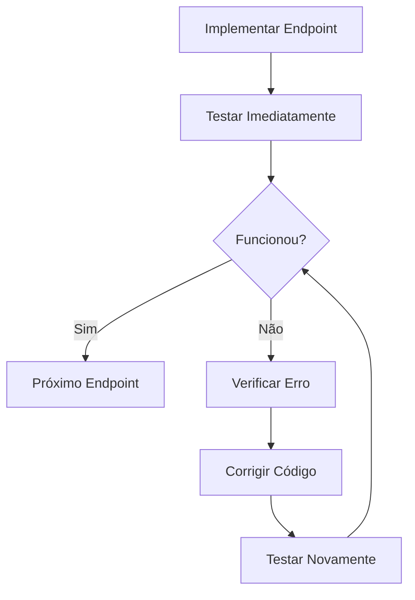

# 🧪 Template de Testes para Agentes

## Princípio Fundamental
**TESTAR IMEDIATAMENTE após implementar cada endpoint. NÃO prosseguir se houver erro.**

## Estrutura Padrão de Teste

### 1. Teste Individual por Endpoint
```bash
# Após implementar endpoint
curl -X [METHOD] "http://localhost:8001/api/v1/[endpoint]" \
     -H "Authorization: Bearer $TOKEN" \
     -H "Content-Type: application/json" \
     -d '[dados se POST/PUT]'

# Se retornar erro:
# 1. PARAR imediatamente
# 2. Verificar log do erro
# 3. Corrigir o código
# 4. Testar novamente
# 5. Só prosseguir quando OK
```

### 2. Script Python de Teste Completo
```python
import requests
import sys

BASE_URL = "http://localhost:8001/api/v1"

def test_endpoint(method, path, data=None, expected_status=200):
    """Testa um endpoint e para se houver erro"""
    # Fazer request
    resp = requests.request(method, f"{BASE_URL}{path}", json=data, headers=headers)
    
    if resp.status_code != expected_status:
        print(f"❌ ERRO em {method} {path}")
        print(f"   Esperado: {expected_status}")
        print(f"   Recebido: {resp.status_code}")
        print(f"   Resposta: {resp.text}")
        print("\n⚠️  CORRIGIR ANTES DE PROSSEGUIR!")
        sys.exit(1)
    
    print(f"✅ {method} {path} - OK")
    return resp.json() if resp.text else None

# Uso:
test_endpoint("GET", "/usuarios/me")
test_endpoint("POST", "/usuarios", data={...}, expected_status=201)
```

### 3. Checklist de Validação por Teste
- [ ] Endpoint responde com status correto
- [ ] Dados retornados no formato esperado
- [ ] Validações funcionando (testar com dados inválidos)
- [ ] Permissões aplicadas corretamente
- [ ] Performance adequada (< 200ms)

## Fluxo de Correção



## Comandos Úteis de Debug

```bash
# Ver logs do servidor
tail -f logs/app.log

# Testar com verbose
curl -v -X GET "http://localhost:8001/api/v1/endpoint" \
     -H "Authorization: Bearer $TOKEN"

# Verificar se servidor está rodando
curl http://localhost:8001/health

# Listar rotas disponíveis
curl http://localhost:8001/openapi.json | jq '.paths | keys'
```

## Erros Comuns e Soluções

| Erro | Causa Provável | Solução |
|------|----------------|---------|
| 404 | Rota não registrada | Verificar router no main.py |
| 422 | Conflito de rotas ou validação | Reordenar rotas, verificar schema |
| 500 | Erro no código | Ver logs, corrigir bug |
| 401 | Token inválido | Refazer login |
| 403 | Sem permissão | Verificar tipo de usuário |

## Regra de Ouro
**NUNCA avançar com erro. Sempre corrigir e testar até funcionar 100%.**